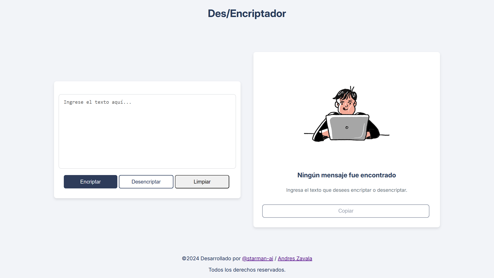

# Des/Encriptador de Texto


## Descripción

Este proyecto es una demostración de mis habilidades en **Front-End** y **Lógica de Programación**. El objetivo del proyecto es desarrollar un sitio web que permita encriptar y desencriptar texto bajo ciertas condiciones. Es un ejercicio práctico para reforzar el uso de **HTML**, **CSS**, y **JavaScript**.

La funcionalidad principal de la herramienta es tomar un texto ingresado por el usuario, aplicarle un sistema de encriptación basado en claves predefinidas, y permitir también la desencriptación del texto.

## Funcionalidades

- **Encriptar texto**: Convierte las vocales en un conjunto de caracteres predefinidos.
- **Desencriptar texto**: Revierte el texto encriptado a su forma original.
- **Validación de entrada**: Solo se permite texto en minúsculas sin acentos ni caracteres especiales.
- **Copiar al portapapeles**: Opción para copiar el texto encriptado/desencriptado con un botón.
- **Advertencias en tiempo real**: Muestra advertencias si el texto ingresado no cumple con los requisitos.

## Reglas de Encriptación

Las siguientes reglas se aplican para encriptar el texto:

- La letra **"e"** se convierte en **"enter"**.
- La letra **"i"** se convierte en **"imes"**.
- La letra **"a"** se convierte en **"ai"**.
- La letra **"o"** se convierte en **"ober"**.
- La letra **"u"** se convierte en **"ufat"**.

Ejemplo:

- `"gato"` se convierte en `"gaitober"`.
- `"gaitober"` se convierte nuevamente en `"gato"`.

## Requisitos del Proyecto

- Solo se admiten letras minúsculas.
- No se permiten acentos ni caracteres especiales.
- Debe ser posible tanto encriptar como desencriptar un texto.

## Capturas de Pantalla



## Tecnologías Utilizadas

- **HTML**: Estructura del contenido.
- **CSS**: Estilos y diseño visual.
- **JavaScript**: Lógica de encriptación y desencriptación.

## Cómo Ejecutar el Proyecto

1. Clona el repositorio:

   ```bash
   git clone https://github.com/starman-ai/encriptadorProyecto.git

2. También puedes visualizar el proyecto directamente como página web en el siguiente enlace:

   [Des/Encriptador](https://starman-ai.github.io/encriptadorProyecto/)
